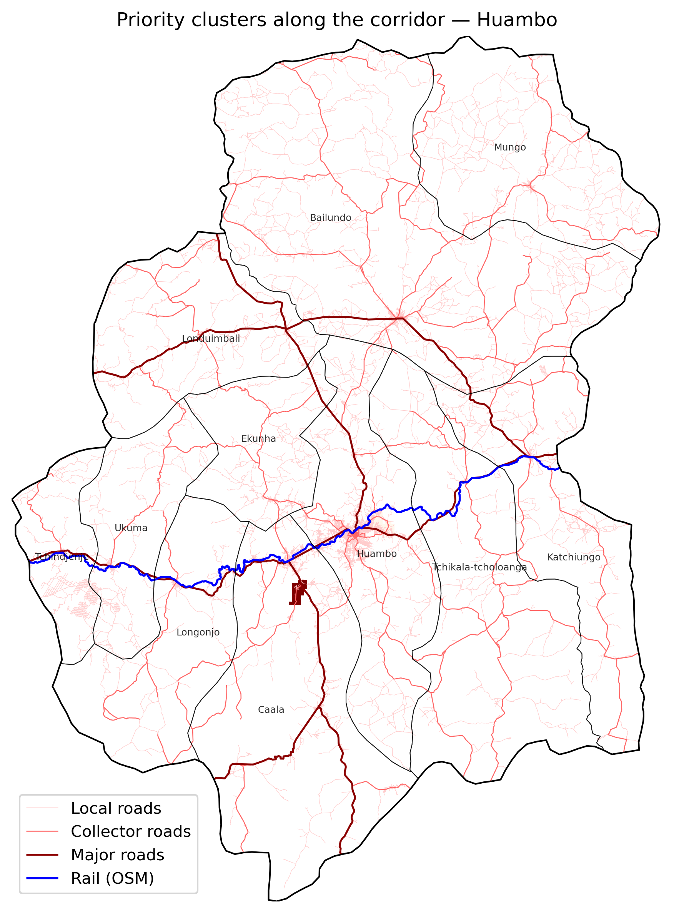
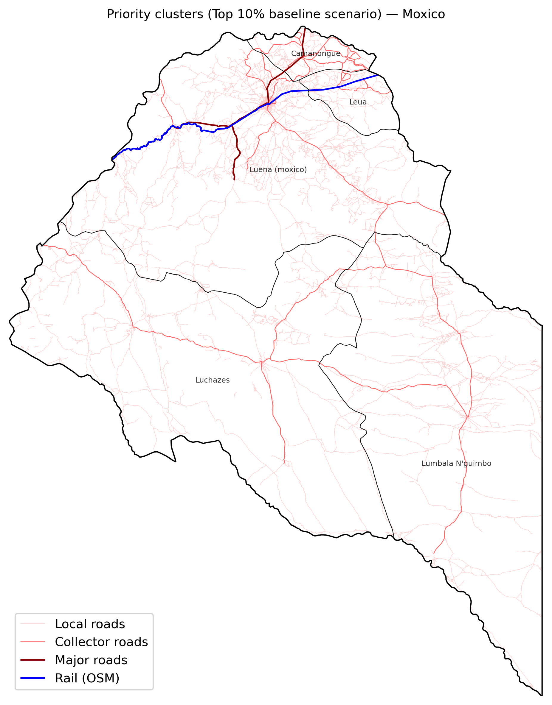
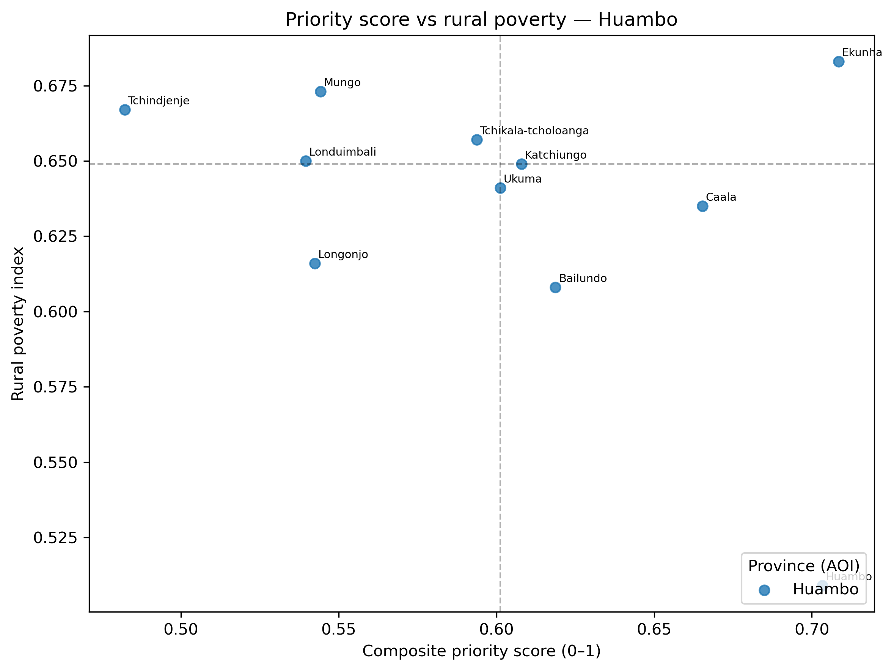
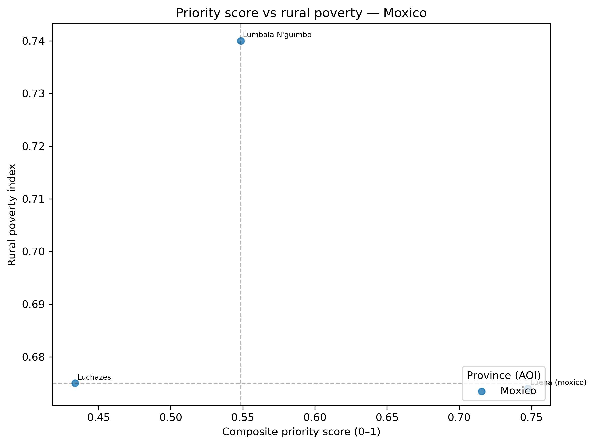
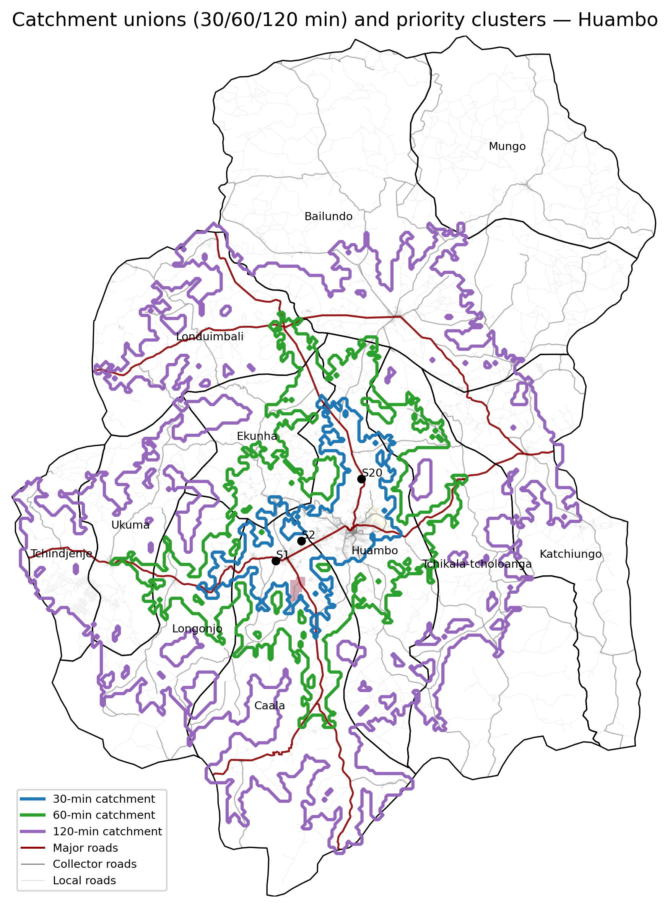
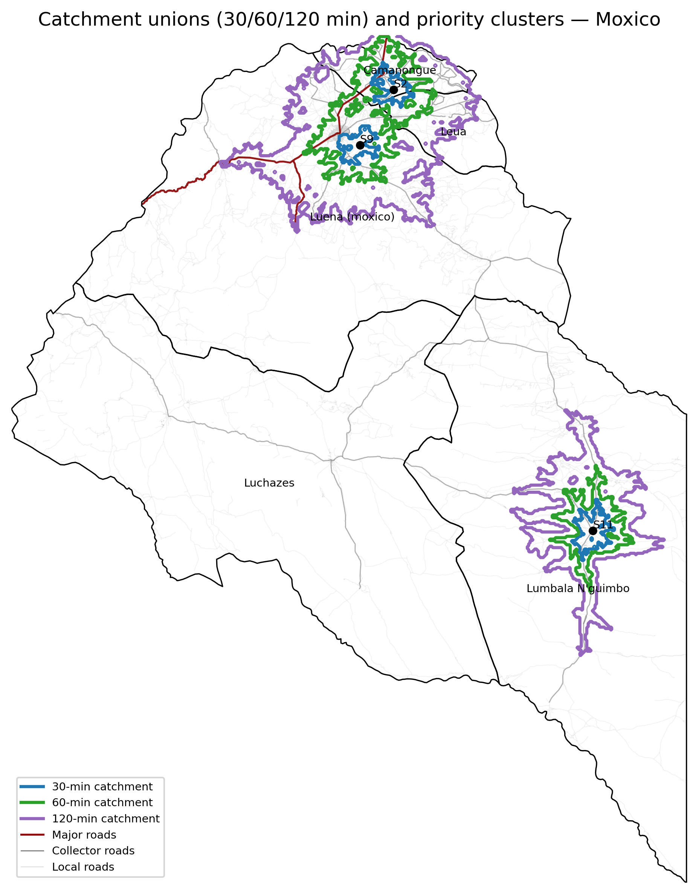
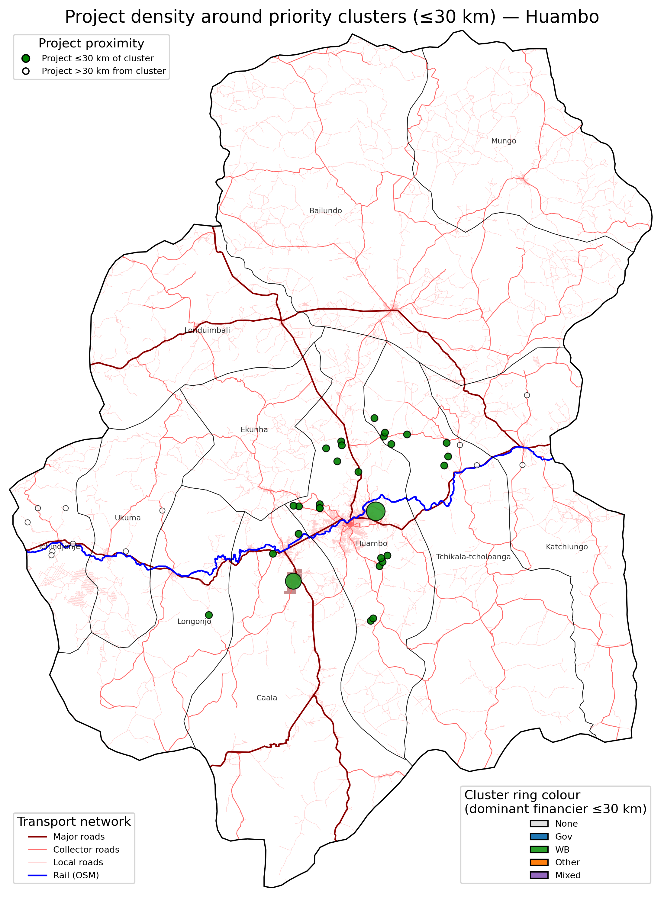
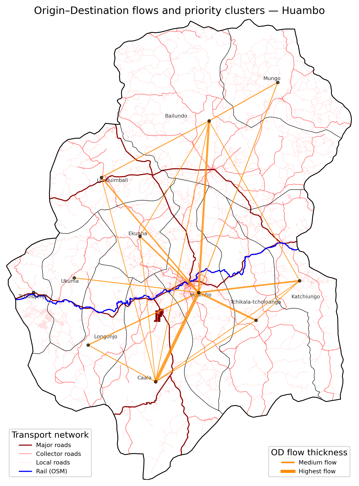
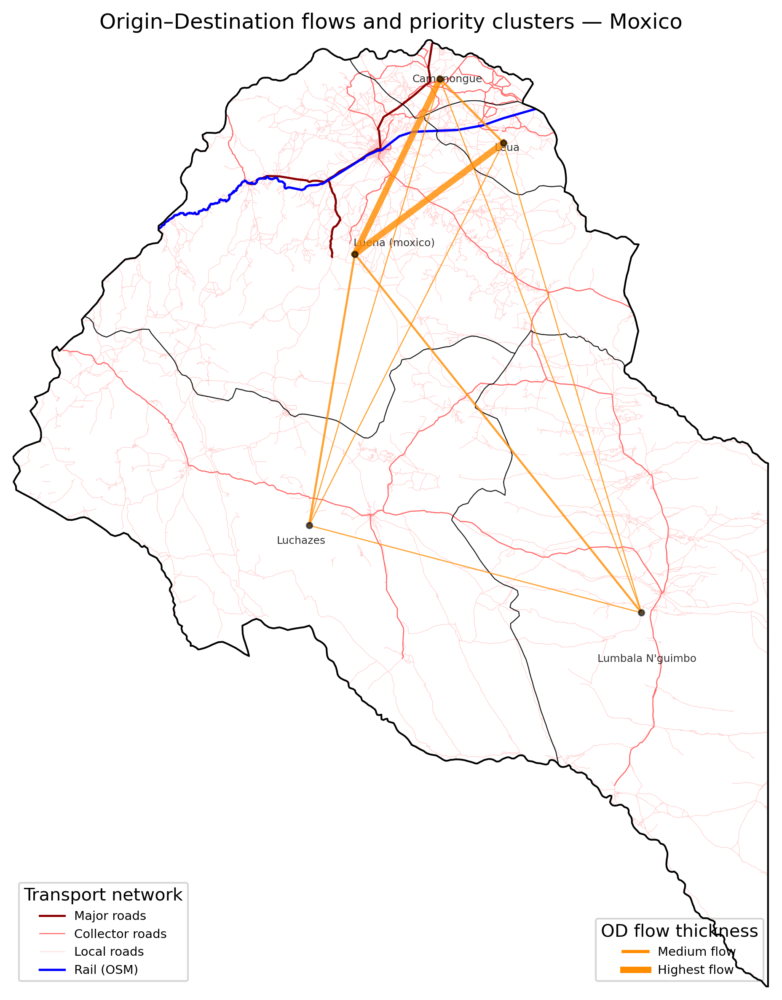

# Corridor-wide results & summary

This page summarizes the **main quantitative results** from the corridor
analysis. It is designed for decision makers and analysts who want to see
the *numbers, charts and maps* before diving into the detailed views in
Chapters 1–8.

The narrative here is **province-agnostic**: the same indicators are
reported for each AOI where the pipeline has been run (e.g. Huambo now,
additional provinces later). Differences across provinces come entirely
from the data, not from ad hoc methods.

> The flowchart below summarises the data sources, processing steps, and outputs used to generate the tables and figures in this section. It is mainly intended for readers who want to understand the underlying workflow.

```{mermaid}
---
config:
  layout: elk
---
flowchart TB
 subgraph Inputs["Inputs"]
        A1["Access data: roads & travel times"]
        A2["Poverty and food insecurity data"]
        A3["Population and cropland grids"]
        A4["Projects and candidate sites"]
  end
 subgraph Core_Analysis["Core analysis steps"]
        B1["Step 07: 1 km priority surface"]
        B2["Steps 06 & 09: Admin2 indicators and scores"]
        B3["Step 11: Priority clusters"]
        B4["Step 12: Catchments (30 / 60 / 120 min)"]
        B5["Step 13: Project synergies"]
        B6["Step 14: OD-lite flows"]
  end
 subgraph Outputs["Outputs"]
        C1["Summary tables S1–S5"]
        C2["Maps and dashboard views"]
  end
    A1 --> B1
    A2 --> B2
    A3 --> B1 & B4
    A4 --> B4 & B5
    B1 --> B2 & B3
    B2 --> B3 & B6
    B3 --> B4 & B5 & C2
    B4 --> C1 & C2
    B5 --> C1 & C2
    B6 --> C1 & C2
```

---

## 1. Where do the strongest priority clusters emerge?

Across all provinces processed so far, the 1-km priority surface (Step 07)
reveals a small number of **high-intensity clusters** that concentrate
most of the potential beneficiaries. These clusters represent places where:

- multiple constraints stack (low baseline access, poor electrification,
  high rural poverty and/or food insecurity), and
- there is enough **population and cropland** to justify coordinated
  investments.

> Flowchart below provides a schematic of how the 1-km priority surface, population, and cropland data are combined to identify priority clusters and produce Table S1 and Figure S1.

```{mermaid}
flowchart TB
 subgraph S4_inputs["Inputs"]
        s4i1["1 km priority surface (Step 07)"]
        s4i2["Population grid"]
        s4i3["Cropland grid"]
        s4i4["Admin1/Admin2 boundaries"]
  end
 subgraph S4_process["Processing"]
        s4p1["Apply top 10% threshold to priority surface"]
        s4p2["Identify contiguous priority clusters"]
        s4p3["Compute cluster stats: area, people, cropland"]
        s4p4["Aggregate to province level for summary table"]
  end
 subgraph S4_outputs["Outputs for Slide 4"]
        s4o1["Table S1: priority clusters by province"]
        s4o2["Figure S1: map of priority clusters along corridor"]
        s4o3["Messages on where needs and opportunities stack"]
  end
    s4i1 --> s4p1
    s4i2 --> s4p3
    s4i3 --> s4p3
    s4i4 --> s4p2
    s4p1 --> s4p2
    s4p2 --> s4p3 & s4o2
    s4p3 --> s4p4
    s4p4 --> s4o1
    s4o1 --> s4o3
    s4o2 --> s4o3
```


**Table S1** below summarizes, for each province and its top clusters:

- the **total priority cluster area** in km²,
- the share of the province’s population located inside the priority clusters (the Top 10% surface after pruning small speckles),
- the share of cropland inside the priority cluster, and
- the number of distinct clusters.

> **Table S1. Priority clusters by province (illustrative structure)**  
> *Generated from `{AOI}_priority_clusters.csv` and
> `{AOI}_kpis_isochrones.csv`.*

| Province (AOI) | Number of priority clusters | Priority cluster area (km²) | Population in clusters (people) | Total population (province, people)  | Population in clusters (% of province total) | Cropland in clusters (km²) | Total cropland (province, km²) | Cropland in clusters (% of province total cropland) | Population density in clusters (people/km²) | Cropland share of cluster area (km² cropland per km² area) |
| ---- | ---- | ---- | ---- | ---- | ---- | ---- | ---- | ---- | ---- | ---- |
| Benguela | … | … | … | … | … | … | … | … | … | … |
| Huambo | 2 | 52.86 | 31776.0 | 2997196.75 | 1.06 | 34.72 | 10156.91 | 0.34 | 601.14 | 0.66 |
| Bie      | …  | … | … | … | … | … | … | … | … | … |
| Moxico | 0  | 0.0  | 0.0  | 756128.37  | 0.0 | 0.0 | 346.98 | 0.0 | NaN | NaN |
| Moxico Leste | … | …  | …  | …  | … | … | … | … | … | … |

**Figure S1** shows the **spatial pattern of priority clusters** along the
corridor: clusters hug the rail and primary road spine in a few key
segments, rather than being evenly spread across all municipalities.

> **Figure S1. Corridor-wide priority clusters**  
> *Static map showing priority clusters (Step 11) overlaid on the
> Lobito Corridor rail line and key roads, with provincial boundaries.*

::::{tab-set}
:::{tab-item} Benguela
:sync: key1

:::

:::{tab-item} Huambo
:sync: key2

:::

:::{tab-item} Bie
:sync: key3

:::

:::{tab-item} Moxico
:sync: key4

:::

:::{tab-item} Moxico Leste
:sync: key5

:::
::::

---

## 2. Are we focusing where needs and opportunities coincide?

The Admin2 analysis deliberately balances **need** and **opportunity**, combining the tunable priority raster (Step 07) with municipality indicators from the RAPP survey (Step 06 / Step 09).

- **Need** is captured through rural poverty and, where available,
  food insecurity, long travel times and low electrification.
- **Opportunity** is captured through how much of each municipality lies
  inside the priority mask and how many people and hectares are exposed
  to improved access if we invest there.

For each province, we compute a **composite Admin2 score** that combines:

- the share of the municipality covered by the priority mask,
- rural poverty and food insecurity indices (RAPP-based, where available),
- average travel time to markets or services,
- electrification and, optionally, a wealth proxy (RWI).

This gives a single 0–1 score that can be compared across municipalities
within the same province.

> Flowchart below outlines how municipality-level indicators are normalised and combined into a composite score, and how this links to the quadrant analysis of priority score versus rural poverty used for Table S2 and Figure S2.

```{mermaid}
---
config:
  layout: dagre
---
flowchart TB
 subgraph S5_inputs["Inputs"]
        s5i1["Admin2 indicators: poverty, food insecurity, travel time, electrification, RWI"]
        s5i2["Share of municipality in priority mask"]
        s5i3["Admin2 lookup and names"]
  end
 subgraph S5_process["Processing"]
        s5p1["Normalise indicators to common 0 to 1 scale"]
        s5p2["Compute composite Admin2 score"]
        s5p3["Rank municipalities within each province"]
        s5p4["Compare score vs rural poverty to define quadrants"]
        s5p5["Estimate rural poor by municipality"]
        s5p6["Summarise rural poor shares by quadrant"]
  end
 subgraph S5_outputs["Outputs for Summary 2"]
        s5o1["Table S2: top municipalities by composite score"]
        s5o2["Figure S2: score vs rural poverty scatter"]
        s5o3["Quadrant summary: counts and share of rural poor"]
        s5o4["Equity messages: alignment and under prioritised areas"]
  end
    s5i1 --> s5p1
    s5i2 --> s5p2
    s5i3 --> s5p3
    s5p1 --> s5p2
    s5p2 --> s5p3 & s5p4
    s5p4 --> s5p5 & s5o2
    s5p5 --> s5p6
    s5p3 --> s5o1
    s5p6 --> s5o3
    s5o1 --> s5o4
    s5o2 --> s5o4
    s5o3 --> s5o4
```

**Table S2** highlights, for each province, the **top-ranked municipalities**
and how they compare against the provincial average on key equity and
access indicators.

> **Table S2. Top 5 municipalities by composite score (illustrative structure)**  
> *Generated from `{AOI}_priority_muni_rank.csv` (one file per province) and
> aggregated into a single corridor-wide table.*

::::{tab-set}
:::{tab-item} Benguela
:sync: key1

| Province (AOI) | Municipality (Admin2) | Composite score (0–1) | Rural poverty index | Food insecurity index | Mean travel time (min) | % electrified | Share of province priority area (%) |
| ---- | ---- | ---- | ---- | ---- | ---- | ---- | ---- |
| Benguela | ... | ... | ... | ... | ... | ... | ... |
| Benguela | ... | ... | ... | ... | ... | ... | ... |
| Benguela | ... | ... | ... | ... | ... | ... | ... |
| Benguela | ... | ... | ... | ... | ... | ... | ... |
| Benguela | ... | ... | ... | ... | ... | ... | ... |

:::

:::{tab-item} Huambo
:sync: key2

| Province (AOI) | Municipality (Admin2) | Composite score (0–1) | Rural poverty index | Food insecurity index | Mean travel time (min) | % electrified | Share of province priority area (%) |
| ---- | ---- | ---- | ---- | ---- | ---- | ---- | ---- |
| Huambo | Ekunha     | 0.708 | 0.683 | 0.685 | 61.163  | 16.3  | 0.000   |
| Huambo | Huambo     | 0.703 | 0.509 | 0.675 | 39.249  | 12.0  | 50.827  |
| Huambo | Caala      | 0.665 | 0.635 | 0.663 | 71.650  | 37.6  | 49.173  |
| Huambo | Bailundo   | 0.619 | 0.608 | 0.626 | 105.837 | 26.7  | 0.000   |
| Huambo | Katchiungo | 0.608 | 0.649 | 0.630 | 91.717  | 51.9  | 0.000   |

:::

:::{tab-item} Bie
:sync: key3

| Province (AOI) | Municipality (Admin2) | Composite score (0–1) | Rural poverty index | Food insecurity index | Mean travel time (min) | % electrified | Share of province priority area (%) |
| ---- | ---- | ---- | ---- | ---- | ---- | ---- | ---- |
| Bie | ... | ... | ... | ... | ... | ... | ... |
| Bie | ... | ... | ... | ... | ... | ... | ... |
| Bie | ... | ... | ... | ... | ... | ... | ... |
| Bie | ... | ... | ... | ... | ... | ... | ... |
| Bie | ... | ... | ... | ... | ... | ... | ... |

:::

:::{tab-item} Moxico
:sync: key4

| Province (AOI) | Municipality (Admin2) | Composite score (0–1) | Rural poverty index | Food insecurity index | Mean travel time (min) | % electrified | Share of province priority area (%) |
| ---- | ---- | ---- | ---- | ---- | ---- | ---- | ---- |
| Moxico | Luena (moxico)        | 0.748  | 0.674  | 0.640 | 145.567  | 4.9  | NaN |
| Moxico | Lumbala N'guimbo      | 0.549  | 0.740  | 0.684 | 484.487  | 1.6  | NaN |
| Moxico | Luchazes              | 0.434  | 0.675  | 0.693 | 327.545  | 5.1  | NaN |
| Moxico | Camanongue            | NaN    | 0.728  | 0.738 | 101.129  | 4.5  | NaN |
| Moxico | Leua                  | NaN    | 0.627  | 0.784 | 75.766   | 18.5 | NaN |

:::

:::{tab-item} Moxico Leste
:sync: key5

| Province (AOI) | Municipality (Admin2) | Composite score (0–1) | Rural poverty index | Food insecurity index | Mean travel time (min) | % electrified | Share of province priority area (%) |
| ---- | ---- | ---- | ---- | ---- | ---- | ---- | ---- |
| Moxico Leste | ... | ... | ... | ... | ... | ... | ... |
| Moxico Leste | ... | ... | ... | ... | ... | ... | ... |
| Moxico Leste | ... | ... | ... | ... | ... | ... | ... |
| Moxico Leste | ... | ... | ... | ... | ... | ... | ... |
| Moxico Leste | ... | ... | ... | ... | ... | ... | ... |

:::
::::

To test whether the composite score actually aligns with equity objectives,
we compare **priority score vs. rural poverty** across all provinces.

**Figure S2** shows, for every municipality where data are available:

- the composite priority score on the x-axis,
- the rural poverty index on the y-axis, and
- points colored by province.

The dashed lines mark the median score and median rural poverty across
the corridor, dividing municipalities into four quadrants:

- **high score & high poverty** (ideal alignment),
- **high score & lower poverty** (valid but efficiency-driven),
- **lower score & high poverty** (potentially “missed” poor municipalities),
- **lower score & lower poverty** (naturally deprioritized).

> **Figure S2. Priority score vs. rural poverty, all municipalities**  
> *Scatter plot built from all `{AOI}_priority_muni_rank.csv` files, with points
> colored by province and a small number of outliers labelled by Admin2 name.*

::::{tab-set}
:::{tab-item} Benguela
:sync: key1

:::

:::{tab-item} Huambo
:sync: key2


Quadrant Statistics

| Quadrant (score x poverty)  | Number of municipalities | Estimated rural poor (people) | Share of province’s rural poor (%) |
| ---- | ---- | ---- | ---- |
| High score & high poverty   | 3  | 57798.0  | 18.0 |
| High score & lower poverty  | 3  | 55377.0  | 18.0 |
| Lower score & high poverty  | 3  | 43169.0  | 14.0 |
| Lower score & lower poverty | 2  | 157305.0 | 50.0 |

- About 3 of 11 municipalities (27.3%) fall in the **high score & high poverty** quadrant, representing roughly 18.4% of the estimated rural poor within Huambo” vs “covered by the dataset.
- Around 3 municipalities (27.3%) sit in the **lower score & high poverty** quadrant, accounting for about 13.8% of the estimated rural poor — these are potentially under-prioritized areas.

:::

:::{tab-item} Bie
:sync: key3

:::

:::{tab-item} Moxico
:sync: key4


Quadrant Statistics

| Quadrant (score x poverty)  | Number of municipalities | Estimated rural poor (people) | Share of province’s rural poor (%) |
| ---- | ---- | ---- | ---- |
| High score & high poverty   | 3  | 1532.0  | 26.0  |
| Lower score & lower poverty | 2  | 4467.0  | 74.0  |

- About 3 of 5 municipalities (60.0%) fall in the **high score & high poverty** quadrant, representing roughly 26.0% of the estimated rural poor in Moxico covered by the dataset.
:::

:::{tab-item} Moxico Leste
:sync: key5

:::
::::

---

## 3. How many people and hectares benefit within 30/60/120 minutes?

For each candidate site (e.g. existing or potential investments) and
province, the catchment analysis (Step 12) quantifies **how many people
and how much cropland** are reachable within 30, 60, and 120 minutes
along the existing and improved network.

This allows us to compare:

- sites that reach **many people quickly** (high 30-min and 60-min coverage),
- sites that unlock **remote hinterlands** (large 120-min coverage), and
- how well these benefits align with the priority clusters.

> Flowchart below summarises the catchment analysis steps used to estimate people and cropland within 30/60/120 minutes of each site, and how these metrics feed into Table S3 and Figure S3.

```{mermaid}
---
config:
  layout: dagre
---
flowchart TB
 subgraph S6_inputs["Inputs"]
        s6i1["Candidate sites and hubs"]
        s6i2["Travel time surface and network"]
        s6i3["Population grid"]
        s6i4["Cropland grid"]
        s6i5["Priority clusters and mask"]
  end
 subgraph S6_process["Processing"]
        s6p1["Build 30, 60, 120 minute isochrones per site"]
        s6p2["Compute people and cropland within each isochrone"]
        s6p3["Rank sites by 60 minute population coverage"]
        s6p4["Compute share of provincial population per site"]
        s6p5["Union catchments for top sites by threshold"]
        s6p6["Overlay unions with priority clusters and corridor"]
  end
 subgraph S6_outputs["Outputs for Summary 3"]
        s6o1["Table S3: top sites by 60 minute catchment"]
        s6o2["Figure S3: union catchments and clusters map"]
        s6o3["Messages on quick wins and remote hinterlands"]
  end
    s6i1 --> s6p1
    s6i2 --> s6p1
    s6i3 --> s6p2
    s6i4 --> s6p2
    s6i5 --> s6p6
    s6p1 --> s6p2
    s6p2 --> s6p3 & s6p4
    s6p3 --> s6p5 & s6o1
    s6p5 --> s6p6
    s6p6 --> s6o2
    s6o1 --> s6o3
    s6o2 --> s6o3
```

**Table S3** aggregates, for each province, the sites with the largest
**60-minute catchments**, showing:

- people and cropland within 60 minutes of each site, and
- the **share of the province’s population** that each site alone can reach
  within 60 minutes.

> **Table S3. Top sites by 60-minute catchment**  
> *Generated from `{AOI}_catchments_kpis.csv` and site metadata.*

::::{tab-set}
:::{tab-item} Benguela
:sync: key1

:::

:::{tab-item} Huambo
:sync: key2

| Province (AOI) | Site ID | Site type (e.g. market / hub) | Population within 60 min | Cropland (km²) within 60 min | % of provincial population within 60 min of this site |
| ---- | ---- | ---- | ---- | ---- | ---- |
| huambo   | site_1  | unknown   | 1367563  | 1320.54  | 45.63  |
| huambo   | site_2  | unknown   | 1355369  | 1186.10  | 45.22  |
| huambo   | site_20 | unknown   | 1338284  | 939.56   | 44.65  |
| huambo   | site_5  | unknown   | 1302686  | 937.28   | 43.46  |
| huambo   | site_6  | unknown   | 1280394  | 889.48   | 42.72  |
| huambo   | site_10 | unknown   | 1279382  | 743.51   | 42.69  |
| huambo   | site_12 | unknown   | 1273502  | 867.43   | 42.49  |
| huambo   | site_11 | unknown   | 1269161  | 819.31   | 42.34  |
| huambo   | site_13 | unknown   | 1269161  | 819.31   | 42.34  |
| huambo   | site_8  | unknown   | 1217688  | 761.90   | 40.63  |

:::

:::{tab-item} Bie
:sync: key3

:::

:::{tab-item} Moxico
:sync: key4

| Province (AOI) | Site ID | Site type (e.g. market / hub) | Population within 60 min | Cropland (km²) within 60 min | % of provincial population within 60 min of this site |
| ---- | ---- | ---- | ---- | ---- | ---- |
| Moxico | site_9  | unknown   | 480541  | 60.60  | 63.55 |
| Moxico | site_2  | unknown   | 68133   | 15.47  | 9.01  |
| Moxico | site_11 | unknown   | 47240   | 10.60  | 6.25  |
| Moxico | site_10 | unknown   | 47157   | 16.18  | 6.24  |
| Moxico | site_5  | unknown   | 19370   | 31.55  | 2.56  |
| Moxico | site_7  | unknown   | 14404   | 39.36  | 1.90  |
| Moxico | site_3  | unknown   | 9982    | 11.02  | 1.32  |
| Moxico | site_12 | unknown   | 7804    | 7.53   | 1.03  |
| Moxico | site_8  | unknown   | 3706    | 0.31   | 0.49  |
| Moxico | site_1  | unknown   | 1623    | 1.15   | 0.21  |
:::

:::{tab-item} Moxico Leste
:sync: key5

:::
::::

**Figure S3** illustrates, for a selected subset of sites along the corridor,
how the **30/60/120-minute catchments** nest within the priority clusters
and corridor infrastructure.

> **Figure S3. Catchment isochrones and priority clusters**  
> *Static map showing 30/60/120-minute union catchments around top-ranked
> sites, overlaid with priority clusters and corridor infrastructure.*

::::{tab-set}
:::{tab-item} Benguela
:sync: key1

:::

:::{tab-item} Huambo
:sync: key2

:::

:::{tab-item} Bie
:sync: key3

:::

:::{tab-item} Moxico
:sync: key4

:::

:::{tab-item} Moxico Leste
:sync: key5

:::
::::

---

## 4. Are we stacking with other investments or creating islands?

The synergies overlay (Step 13) quantifies, for each priority site and
cluster centroid, **how many projects** from Government, World Bank,
and other partners lie within specified radii (e.g. ≤5 km, ≤10 km, ≤30 km).

This allows us to identify:

- **high-opportunity nodes**, where multiple projects intersect within
  short distances (good candidates for bundling),
- **isolated clusters**, where there is strong need but few nearby projects,
  and
- places where an investment might help **bridge separate project islands**.

For the summary tables and maps in this section, we focus on a radius of
**30 km**, which is where meaningful co-location begins to appear along
the corridor. At tighter radii (≤10 km), many clusters currently have few
or no overlapping projects, indicating that synergies mostly emerge at
the wider corridor scale rather than right next to cluster centroids.

> Flowchart below shows how project locations from Government, the World Bank, and other partners are overlaid around priority clusters to construct the project density metrics presented in Table S4 and Figure S4. For provinces where synergies could not be computed, this flowchart represents the intended workflow.

```{mermaid}
---
config:
  layout: dagre
---
flowchart TB
 subgraph S7_inputs["Inputs"]
        s7i1["Priority clusters and centroids"]
        s7i2["Government project locations"]
        s7i3["World Bank project locations"]
        s7i4["Other partners project locations"]
        s7i5["User chosen distance thresholds, for example 10 km or 30 km"]
  end
 subgraph S7_process["Processing"]
        s7p1["Count projects by type within each radius around clusters"]
        s7p2["Compute total projects per cluster and radius"]
        s7p3["Identify high opportunity nodes with many nearby projects"]
        s7p4["Flag isolated clusters with few projects nearby"]
        s7p5["Prepare summary table for chosen radius"]
  end
 subgraph S7_outputs["Outputs for Summary 4"]
        s7o1["Table S4: clusters with highest project density"]
        s7o2["Figure S4: map of cluster rings and nearby projects"]
        s7o3["Messages on bundling opportunities and gaps"]
  end
    s7i1 --> s7p1
    s7i2 --> s7p1
    s7i3 --> s7p1
    s7i4 --> s7p1
    s7i5 --> s7p1
    s7p1 --> s7p2
    s7p2 --> s7p3 & s7p4 & s7p5 & s7o2
    s7p5 --> s7o1
    s7o1 --> s7o3
    s7o2 --> s7o3
```

**Table S4** lists, for each province, the **clusters with the highest
number of nearby projects** within 30 km.

> **Table S4. Clusters with highest project density within 30 km**  
> *Generated from `{AOI}_cluster_synergies.csv`.*

::::{tab-set}
:::{tab-item} Benguela
:sync: key1

:::

:::{tab-item} Huambo
:sync: key2

| Province (AOI) | Cluster ID | Projects within 10 km (Gov) | Projects within 10 km (WB) | Projects within 10 km (Other) | Total projects within 10 km |
| ---- | ---- | ---- | ---- | ---- | ---- |
| Huambo         | 1 | 0 | 23 | 0 | 23 |
| Huambo         | 2 | 0 | 14 | 0 | 14 |

For Huambo, two priority clusters stand out when we look at projects
within a **30 km** radius:

- **Cluster 1** sits in a dense halo of World Bank operations, with
  **23 World Bank projects within 30 km** and no government or other-partner
  projects recorded in this radius.
- **Cluster 2** is also well connected, with **14 World Bank projects
  within 30 km**, again without overlapping government or other-partner
  investments in the same band.

At tighter distances (≤10 km), the synergies table reports **zero projects**
around both clusters. This suggests that, in Huambo, co-location with
other investments currently happens at the **corridor scale (≤30 km)** rather
than directly adjacent to the cluster centroids. New investments in these
clusters could therefore act as **anchors for bundling and coordination**
with existing World Bank portfolios, while still leaving room to attract
government and other partners closer to the priority nodes over time.

:::

:::{tab-item} Bie
:sync: key3

:::

:::{tab-item} Moxico
:sync: key4

:::

:::{tab-item} Moxico Leste
:sync: key5

:::
::::

**Figure S4** shows a **corridor-wide map of project density**, where the
size of each cluster marker is proportional to the number of projects
within 30 km, and color encodes the dominant financier.

> **Figure S4. Project density around priority clusters (≤30 km)**  
> *Static map with cluster markers sized by project counts within 30 km,
> colored by dominant project type (Gov / WB / Other / Mixed).*

::::{tab-set}
:::{tab-item} Benguela
:sync: key1

:::

:::{tab-item} Huambo
:sync: key2

:::

:::{tab-item} Bie
:sync: key3

:::

:::{tab-item} Moxico
:sync: key4

:::

:::{tab-item} Moxico Leste
:sync: key5

:::
::::

---

## 5. How does movement along the corridor reinforce these priorities?

Where OD-Lite has been run (Step 14), we have a simple gravity model of
flows between municipalities, using population and distances, optionally
tilted by wealth (RWI). This lens shows **which segments of the corridor
carry the most interaction**, and how that intersects with priorities.

We summarize:

- the **top OD pairs** by modelled flow,
- municipalities with the highest **combined in- and out-flows** (throughput),
- how many of those high-throughput municipalities intersect with
  **priority clusters and top-ranked Admin2s**, and
- whether **both ends of a flow** lie inside the **top priority mask**.

> Flowchart below summarises how the OD-Lite gravity model uses population, distances, and zone attributes to generate OD flows, and how these are aggregated into the high-throughput pairs shown in Table S5 and the OD map in Figure S5.

```{mermaid}
---
config:
  layout: elk
---
flowchart TB
 subgraph S8_inputs["Inputs"]
        s8i1["OD zones and centroids by Admin2"]
        s8i2["Population and optional RWI by zone"]
        s8i3["Inter zone distances"]
        s8i4["Priority mask and Admin2 priority flag"]
  end
 subgraph S8_process["Processing"]
        s8p1["Run gravity model to estimate OD flows"]
        s8p2["Symmetrise and aggregate flows to undirected pairs"]
        s8p3["Rank OD pairs by modelled flow"]
        s8p4["Compute throughput per municipality from in flows and out flows"]
        s8p5["Flag pairs where both ends are in top priority mask"]
  end
 subgraph S8_outputs["Outputs for Summary 5"]
        s8o1["Table S5: high throughput municipality pairs"]
        s8o2["Figure S5: OD flows overlaid on priority clusters"]
        s8o3["Messages on key movement corridors and priority alignment"]
  end
    s8i1 --> s8p1
    s8i2 --> s8p1
    s8i3 --> s8p1
    s8i4 --> s8p5
    s8p1 --> s8p2
    s8p2 --> s8p3 & s8p4
    s8p3 --> s8p5 & s8o1 & s8o2
    s8o1 --> s8o3
    s8o2 --> s8o3
```

> **Table S5. High-throughput municipality pairs**  
> *Generated from `{AOI}_od_gravity.csv` and `{AOI}_od_zone_attrs.csv`, including a
> flag indicating whether both origin and destination lie inside the top
> priority mask.*

| Province (AOI) | Origin Admin2 | Destination Admin2 | Modelled flow (relative) | Distance (km) | Both in top priority mask? |
| ---- | ---- | ---- | ---- | ---- | ---- |
| Huambo | Caala    | Huambo              | 97938.8  | 55.7  | Yes  |
| Huambo | Bailundo | Huambo              | 55540.2  | 96.8  | No  |
| Huambo | Huambo   | Tchikala-tcholoanga | 49511.4  | 35.9  | No  |
| Huambo | Huambo   | Katchiungo          | 41293.9  | 57.3  | No  |
| Huambo | Ekunha   | Huambo              | 33430.5  | 45.8  | No  |
| Huambo | Huambo   | Londuimbali         | 31016.6  | 84.9  | No  |
| Huambo | Huambo   | Longonjo            | 26294.1  | 68.8  | No  |
| Huambo | Bailundo | Mungo               | 18917.9  | 44.4  | No  |
| Huambo | Bailundo | Londuimbali         | 16082.6  | 68.6  | No  |
| Huambo | Huambo   | Ukuma               | 15144.4  | 70.5  | No  |

::::{tab-set}
:::{tab-item} Benguela
:sync: key1

:::

:::{tab-item} Huambo
:sync: key2

:::

:::{tab-item} Bie
:sync: key3

:::

:::{tab-item} Moxico
:sync: key4

| Province (AOI) | Origin Admin2 | Destination Admin2 | Modelled flow (relative) | Distance (km) | Both in top priority mask? |
| ---- | ---- | ---- | ---- | ---- | ---- |
| Moxico | Leua           | Luena (moxico)     | 31106.8 | 108.5 | No |
| Moxico | Camanongue     | Luena (moxico)     | 29860.1 | 113.7 | No |
| Moxico | Camanongue     | Leua               | 6789.8  | 52.6  | No |
| Moxico | Luchazes       | Luena (moxico)     | 6200.2  | 160.6 | No |
| Moxico | Luena (moxico) | Lumbala N'guimbo   | 6010.6  | 267.8 | No |
| Moxico | Luchazes       | Lumbala N'guimbo   | 660.7   | 199.7 | No |
| Moxico | Leua           | Lumbala N'guimbo   | 417.4   | 285.8 | No |
| Moxico | Camanongue     | Lumbala N'guimbo   | 213.5   | 332.9 | No |
| Moxico | Leua           | Luchazes           | 146.6   | 250.4 | No |
| Moxico | Camanongue     | Luchazes           | 110.9   | 271.5 | No |
:::

:::{tab-item} Moxico Leste
:sync: key5

:::
::::

> **Figure S5. Origin-Destination flows and priority clusters along the corridor**  
> *Static map showing thick OD arcs for the top flows, overlaid on the
> priority clusters and corridor infrastructure.*

::::{tab-set}
:::{tab-item} Benguela
:sync: key1

:::

:::{tab-item} Huambo
:sync: key2

:::

:::{tab-item} Bie
:sync: key3

:::

:::{tab-item} Moxico
:sync: key4

:::

:::{tab-item} Moxico Leste
:sync: key5

:::
::::

---

## 6. How to read this page alongside the rest of the book

- This **Summary & results** page is a **corridor-wide dashboard**:
  it aligns indicators across provinces and views.
- **Per-view details** (what each map, table, and indicator really means)
  live in:
  - Chapters 1–8 (decision views),
  - Chapters 9–15 (run anywhere, data, methods).
- The **underlying code** that produced every table and map here is fully
  documented in:
  - [How it works](12-how-it-works.md),
  - [All pipeline code](../references/all-code.md).

Future runs for additional provinces will simply add rows to Tables S1–S5
and additional curves/markers to Figures S2–S5, without changing the
underlying methodology.
